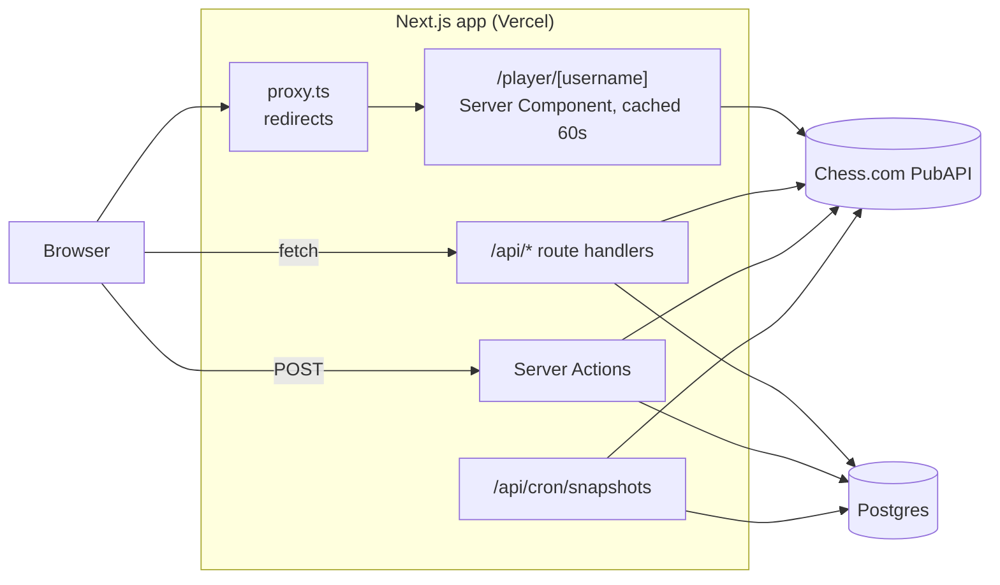

# Architecture

How Daily Gambit is put together. For setup and deployment see the [README](README.md), for the rendering and caching details see [docs/RENDERING.md](docs/RENDERING.md).

Daily Gambit is one Next.js (App Router) app. There is no separate backend: the server side is Server Components, route handlers and Server Actions in the same project, and the only external services are the Chess.com PubAPI and a Postgres database.



## Folder structure

```
src/
├── proxy.ts                      redirects: /?u=name to /player/name, and /player/Name to the lowercase /player/name
├── app/
│   ├── layout.tsx                header, footer, font (next/font), metadata template
│   ├── page.tsx                  landing page (static)
│   ├── globals.css               all styling
│   ├── player/[username]/
│   │   ├── page.tsx              player page (Server Component, ISR)
│   │   ├── loading.tsx           skeleton while the page renders on the server
│   │   ├── error.tsx             error boundary
│   │   └── not-found.tsx         shown for an unknown or invalid username
│   └── api/
│       ├── profile, stats, clubs, tournaments, matches, current-games,
│       │   games, dashboard      read endpoints the browser calls
│       ├── online-status, to-move-games   exist but the UI does not call them
│       └── cron/snapshots        daily job (Vercel Cron)
├── features/player-dashboard/    everything for the dashboard (see below)
├── components/                   small shared UI: Panel, StatCard, LoadingState, EmptyState
├── lib/                          server-side and shared logic, no React
└── utils/errorMessage.ts         turns an error into a friendly message
prisma/
├── schema.prisma
└── migrations/
docs/RENDERING.md
vercel.json                       cron schedule
```

### `src/lib`

| File | What it does |
| --- | --- |
| `chesscom.ts` | The only code that talks to Chess.com. One function per endpoint, a `User-Agent` header, `ChessComApiError` (keeps the HTTP status), and `playerTag()` for cache tags. Monthly game archives are fetched 4 at a time and retried once. |
| `gameRecords.ts` | Turns raw archive games into small per-game records (result, ending, colour, opponent rating, opening). No Next.js imports. |
| `puzzleRush.ts` | Reads Puzzle Rush numbers from a Chess.com `/stats` response. |
| `streaks.ts` | Computes the Puzzle Rush streak from snapshots. A day is active if the attempt count went up since the previous saved day. |
| `snapshots.ts` | `saveSnapshot()` writes today's row (shared by the Server Action and the cron job) and `recentlyTrackedUsernames()` lists who the cron job should track. |
| `apiRoute.ts` | Route handler helpers: read and validate `?username=`, and map errors to 400, 404, 502 or 500. |
| `username.ts` | The username rule (`[a-zA-Z0-9_-]{1,64}`), `normalizeUsername()` (trims, lowercases, accepts `@name` and profile links) and the shared error messages. Safe to import from client code. |
| `prisma.ts` | One shared Prisma client. |

### `src/features/player-dashboard`

| Group | Files |
| --- | --- |
| Server only | `server.ts` (`getProfile`, `getOnlineStatus`), `actions.ts` (Server Actions) |
| Entry points | `index.tsx` (`PlayerDashboard`, the client component for the whole page below the search box), `PlayerSearch.tsx` (search box for the landing and not-found pages) |
| State and data | `hooks.ts` (`usePlayerDashboard`), `usePlayerSearch.ts`, `services.ts` (the `fetch` calls to `/api/*` and the action wrappers) |
| Pure calculations | `derived.ts` (stats summary, rating chart), `insights.ts` (heatmap, results by colour, opponent strength, endings, openings), `gameUtils.ts`, `types.ts` |
| Sections | `PlayerProfileSection`, `Avatar`, `StatCardsSection`, `GamesFilters`, `GamesRatingChart`, `GameInsights`, `PuzzleRushChart`, `SnapshotsTable`, `ToMoveGamesSection`, `CurrentGamesTable`, `ClubsSection`, `TournamentsSection`, `TeamMatchesSection`, `Hero`, `UsernameSearch` |
| `Charts.tsx` | Re-exports the two components that use Recharts, so they load as one lazy chunk |

## Server and client

- **Server Components:** the landing page, the player page and `PlayerProfileSection`. They run only on the server and send no JavaScript for themselves.
- **Client Components:** `PlayerDashboard` and everything below it (they hold state and fetch in the browser), `PlayerSearch`, and `Avatar`.
- The player page renders the profile card on the server and passes it to `PlayerDashboard` as the `profile` prop, so the card stays a Server Component inside the client tree.
- `PlayerDashboard` is rendered with `key={username}`, so moving to another player starts from a fresh state.

## Data flow

### Searching

1. `usePlayerSearch` normalizes the text and checks it against the username rule. An invalid name shows a message and stops.
2. It calls `/api/profile`. If the player does not exist, or Chess.com is down, it shows the error and the page and URL stay as they are.
3. If the player exists it navigates to `/player/<username>` in a transition, so the current page stays usable until the next one is ready.

Searching for the player already on screen is the Refresh button instead of a navigation.

### Opening a player page

1. `proxy.ts` redirects non-canonical URLs (`/player/Hikaru` to `/player/hikaru`). A name that is not valid at all reaches the page, which shows the not-found page.
2. `page.tsx` calls `getProfile` and `getOnlineStatus` together. `getProfile` returns `ok`, `missing` (404, shows `not-found.tsx`) or `unavailable` (the page renders without the profile card). `generateMetadata` uses the same cached call for the page title.
3. The HTML is cached for 60 seconds (ISR). While it renders, `loading.tsx` is shown.
4. In the browser `PlayerDashboard` mounts and calls `refreshAll`:
   - saves today's snapshot (`ingestSnapshot` Server Action), then loads `/api/dashboard` (snapshots and streak);
   - in parallel loads `/api/stats`, `/api/clubs`, `/api/tournaments`, `/api/matches`, `/api/current-games` and `/api/games` (for the chosen category and period).
5. Each section has its own loading flag and shows a skeleton until its data arrives. A failure in one section does not break the others.
6. Changing the category or period in `GamesFilters` reloads only `/api/games`.

Results are tagged with a generation number. If a newer refresh starts, answers from the older one are dropped.

### Refresh

`refreshPlayer` saves a snapshot and calls `updateTag` for the player's cache tag. That expires every Chess.com response cached for the player and the cached page, and the page is re-rendered in the same response. The reads that follow wait for it, so they get fresh data.

## Caching

| Layer | What | How long |
| --- | --- | --- |
| Next data cache | Every Chess.com `fetch` (`next: { revalidate, tags }`) | profile, clubs, tournaments, matches: 5 minutes. Online status, stats, current games, to-move games, game archives: 1 minute |
| ISR | The `/player/[username]` HTML | 60 seconds |
| Request memoization | `getProfile` and `getOnlineStatus` (React `cache`) | one render |
| Client router cache | Pages already visited, so Back is instant | managed by Next |

All Chess.com responses for a player share the tag `player:<username>`.

## Database

Postgres through Prisma. `DATABASE_URL` is used by the app and `DATABASE_URL_UNPOOLED` by migrations.

- **`PuzzleRushSnapshot`**: one row per player per UTC day, unique on `(username, asOf)`. It stores the attempt total, the score total and the best score. Chess.com has no Puzzle Rush history, so these rows are the history. Writes are upserts and only overwrite a value with a real number, never with `null`, so a bad response cannot erase a good snapshot.
- **`DailyPuzzleCheckin`**: defined in the schema and migrations, but no code reads or writes it yet.

Snapshots are written in three places: on every page load, on Refresh, and by the daily cron job.

## Daily cron job

`vercel.json` runs `/api/cron/snapshots` once a day. It requires `Authorization: Bearer $CRON_SECRET` and rejects everything else, so it cannot be used to hammer Chess.com. It saves a snapshot for every player looked up in the last 90 days (up to 200, four at a time), so streaks keep growing on days nobody opens a page.

## Error handling

- **Route handlers:** `apiRoute.ts` maps errors to a status: 400 for a bad username, 404 when Chess.com says the player does not exist, 502 when Chess.com is rate limiting or down, 500 otherwise. The body is always JSON.
- **Client calls:** `services.ts` reads the response defensively (a non-JSON error page does not crash it) and throws `ApiRequestError`, which keeps the status.
- **Server rendering:** a Chess.com outage degrades the page instead of failing it. `error.tsx` catches anything unexpected.
- **Chess.com:** an archive that cannot be loaded is reported as `missingMonths`, so a partial chart is labelled as partial. If every month fails the request fails instead of showing an empty chart.

## Known gaps

- There are no automated tests and no CI.
- There is no rate limiting on the `/api/*` routes or the Server Actions. The input is validated, but anyone can call them.
- Chess.com responses are cast to types, not validated at runtime. The Puzzle Rush and game-record code read fields defensively instead.
- `/api/online-status`, `/api/to-move-games`, `computeDailyPuzzleCalendarStreak` and the `DailyPuzzleCheckin` table are not used by the app.
- With ISR, an unknown player renders the not-found page with status 200 and a `noindex` tag, not a 404.
